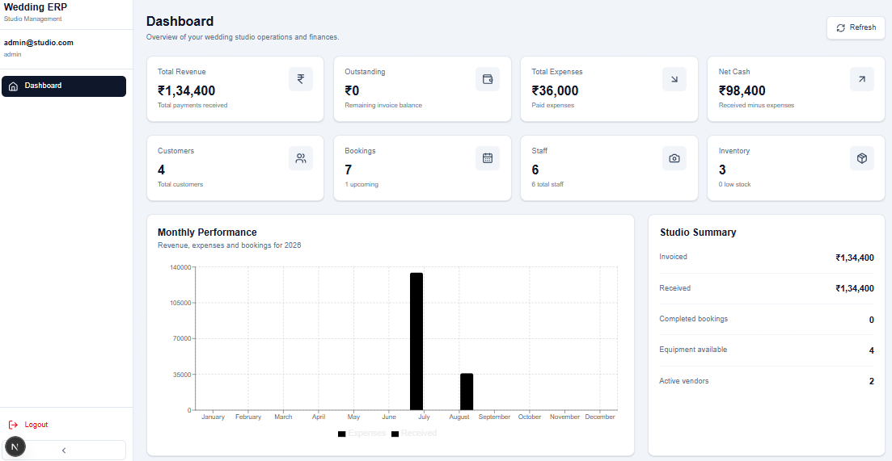
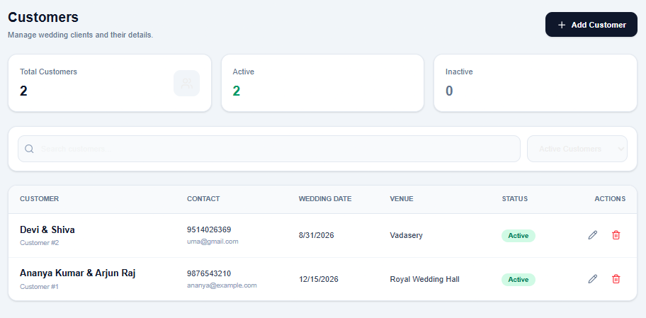
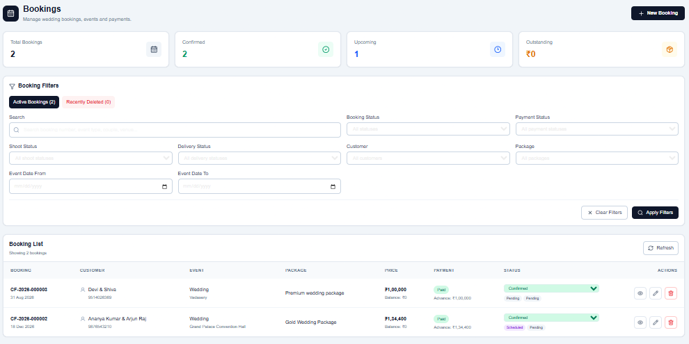

# AI Wedding Studio ERP

A business management ERP application designed for wedding photography
and studio businesses.

The backend is completed using Python, FastAPI, PostgreSQL,
SQLAlchemy, Alembic, and REST APIs.

The frontend is approximately 60% complete and is currently under
active development.

> Status: In Development

## Project Status

🚧 In Development

Backend: ✅ Completed
Database: ✅ Completed
REST APIs: ✅ Completed
Authentication: ✅ Completed (if implemented)
Frontend: 🟡 ~60% completed
AI features: 🚧 Planned / In development
Testing: 🚧 In progress
Deployment: 🚧 Planned

## Backend Features

- Customer management
- Enquiry management
- Booking management
- Event management
- Service/package management
- Payment tracking
- Staff management
- Task management
- REST API endpoints
- PostgreSQL database
- SQLAlchemy ORM
- Alembic database migrations
- API validation
- Authentication and authorization

## Frontend

The frontend is currently under development.

Completed:

- Dashboard
- Customer management UI
- Booking UI

In progress:

- Equipments
- Payments

## Technology Stack

### Backend
- Python
- FastAPI
- SQLAlchemy
- PostgreSQL
- Alembic
- REST APIs

### Frontend
- Node.js
- TypeScript
- FastAPI

### Development
- Git
- GitHub
- VS Code
- Postman
- Swagger / OpenAPI

## Screenshots

### Dashboard

### Customer Management

### Booking Management

## API Documentation

The backend provides REST APIs for managing customers,
enquiries, bookings, events, services, payments, and other
studio operations.

Interactive API documentation is available through FastAPI
Swagger/OpenAPI.

## Planned AI Features

- AI-assisted enquiry responses
- Automatic enquiry summarization
- AI-generated quotation/message drafts
- Follow-up recommendations
- Natural-language business data search
- Customer communication assistance
